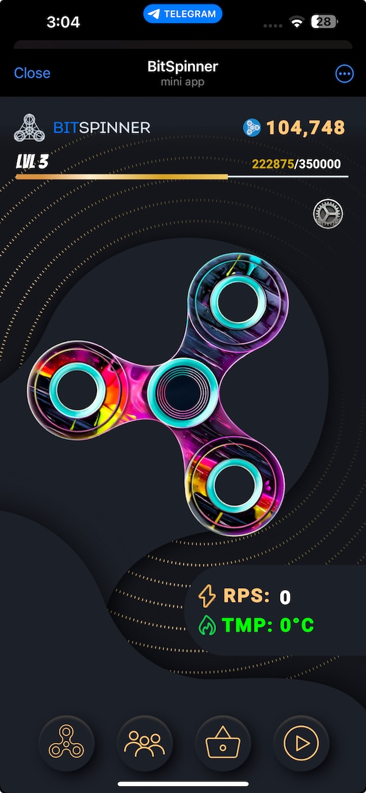
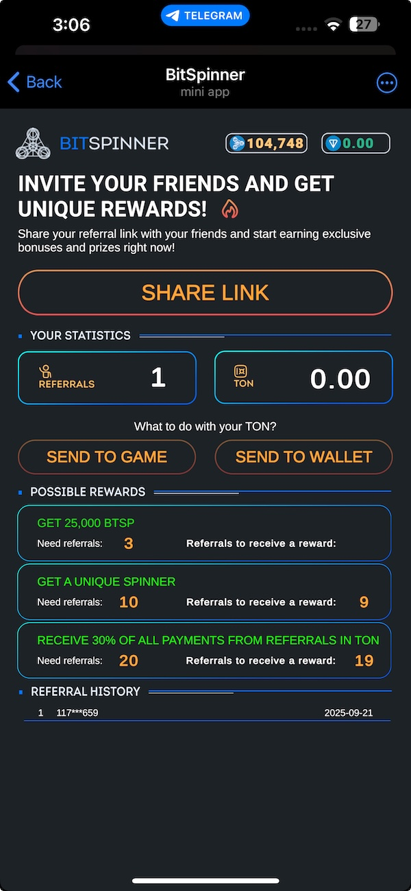
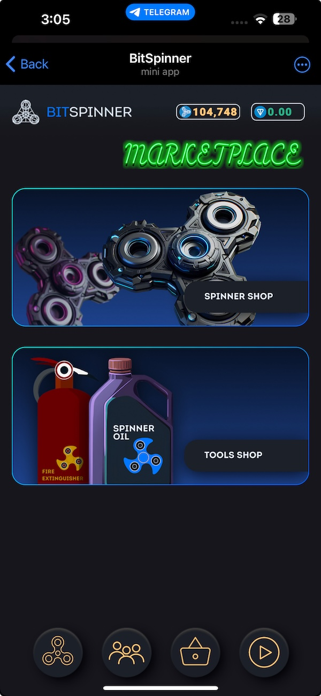
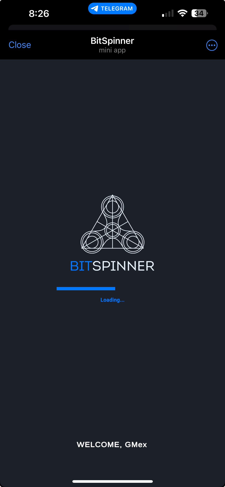

# BitSpinner — Telegram WEB3 Mini App Game

Collect, spin, and profit. Play on Telegram and watch your crypto grow.  
**Client:** Unity/C# • **Backend:** Azure PlayFab + Azure • **Services:** Python (referrals, payments, anti-fraud) • **Infra:** Docker • **Integrations:** Telegram Wallet/Payments & Stars, website + admin bot.

> This repo is a **showcase** (screens, videos, docs). Proprietary source code is not published.

## Play / Demo
- Telegram Mini App: _link coming soon_
- Website: _link coming soon_
- Teaser video: see `/assets/video/teaser.mp4`

## Highlights
- Unity client with isometric UI, progression, saves, mobile perf.
- Azure PlayFab economy, inventory, analytics; Azure functions/services.
- Python microservices: referral codes & rewards, payment processing (crypto wallets & Stars), PlayFab backup-progress mirror, anti-fraud.
- Dockerized production, website + Telegram admin bot.

## Screenshots
# BitSpinner — Telegram WEB3 Mini App Game

Collect, spin, and profit. Play on Telegram and watch your crypto grow.

**Client:** Unity/C#  
**Backend:** Azure PlayFab + Azure  
**Services:** Python (referrals, payments, anti-fraud)  
**Infra:** Docker  
**Integrations:** Telegram Wallet/Payments & Stars, website + admin bot.

> This repo is a **showcase** (screens, videos, docs). Proprietary source code is **not** published.

---

## Screens

  
  
  
  
  

## Short video

- Teaser (mp4): [`media/videos/BitSpinner.mp4`](media/videos/BitSpinner.mp4)  
  *(or link to Telegram/YouTube for full video)*

## Key features
- Telegram Mini App with Wallet/Payments & Stars
- Referral and anti-fraud microservices (Python)
- Azure PlayFab backend + Azure services
- Dockerized production, website & admin bot

## Contact
Business inquiries: [LinkedIn](https://www.linkedin.com/in/gennady-mikhaylov) • email in profile

## Tech Stack
Unity/C#, Azure PlayFab & Azure, Python (FastAPI), Docker, Telegram Mini Apps (Wallet/Payments & Stars).

## Contact
Mikhael Gennady — Cancún, MX  
LinkedIn: https://www.linkedin.com/in/gennady-mikhaylov/  
Email: mikhael1313@pm.me
